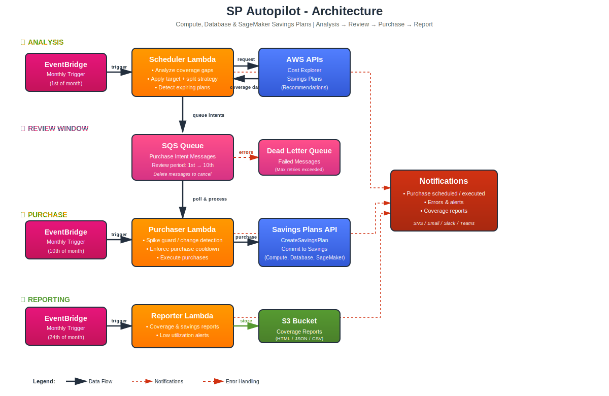

# AWS Savings Plans Automation Module

[](https://opensource.org/licenses/Apache-2.0)


[](https://sonarcloud.io/summary/new_code?id=etiennechabert_terraform-aws-sp-autopilot)
[](https://sonarcloud.io/summary/new_code?id=etiennechabert_terraform-aws-sp-autopilot)
[](https://sonarcloud.io/summary/new_code?id=etiennechabert_terraform-aws-sp-autopilot)

[](https://github.com/etiennechabert/terraform-aws-sp-autopilot/actions/workflows/pr-checks.yml)
[](https://codecov.io/gh/etiennechabert/terraform-aws-sp-autopilot)

Automates AWS Savings Plans purchases based on usage analysis, maintaining consistent coverage while limiting financial exposure through incremental commitments.

## Table of Contents

- [Overview](#overview)
  - [Key Features](#key-features)
  - [Savings Plan Types](#savings-plan-types)
- [Getting Started](#getting-started)
  - [Quick Start](#quick-start)
  - [Examples](#examples)
  - [First Deployment](#first-deployment)
- [Configuration](#configuration)
  - [Purchase Strategies](#purchase-strategies)
  - [Scheduling](#scheduling)
  - [Notifications](#notifications)
  - [Data Granularity](#data-granularity)
- [Architecture](#architecture)
- [Advanced Topics](#advanced-topics)
  - [AWS Organizations Setup](#aws-organizations-setup)
  - [Gradual Rollout](#gradual-rollout)
  - [Canceling Purchases](#canceling-purchases)
- [Reference](#reference)
  - [Configuration Variables](#configuration-variables)
  - [Outputs](#outputs)
  - [Supported Services](#supported-services)
  - [Requirements](#requirements)
- [Contributing](#contributing)
  - [Development](#development)
  - [Testing](#testing)
  - [Pre-commit Hooks](#pre-commit-hooks)
- [Support](#support)
- [License](#license)

**Additional Guides:**
- [Concepts & Glossary](CONCEPTS.md)
- [Error Patterns & Troubleshooting](ERROR_PATTERNS.md)
- [Testing Guide](TESTING.md)
- [Local Development](LOCAL_DEVELOPMENT.md)

**Interactive Tools:**
- 📊 **[AWS Savings Plan Simulator](https://etiennechabert.github.io/terraform-aws-sp-autopilot/)** — Interactive cost visualization tool to explore how Savings Plans optimize costs across different load patterns

## Overview

### Key Features

- **Automated Savings Plans purchasing** — Maintains target coverage without manual intervention
- **Three purchase strategies** — Fixed, Dichotomy, and Follow-AWS for different workload patterns
- **Three SP types supported** — Compute, Database, and SageMaker independently tracked
- **Human review window** — Configurable delay between scheduling and purchasing allows cancellation
- **Risk management** — Spreads financial commitments over time with configurable purchase limits
- **Coverage cap enforcement** — Hard ceiling prevents over-commitment if usage shrinks
- **Email & webhook notifications** — SNS, Slack, and Microsoft Teams integration
- **Auditable and transparent** — All decisions logged, all purchases tracked with idempotency

### Savings Plan Types

| Type | Coverage | Terms | Payment Options | Max Discount | Configuration |
|------|----------|-------|-----------------|--------------|---------------|
| **Compute** | EC2, Lambda, Fargate | 1-year, 3-year | All/Partial/No Upfront | Up to 66% | Fully configurable |
| **Database** | RDS, Aurora, DynamoDB, ElastiCache (Valkey), DocumentDB, Neptune, Keyspaces, Timestream, DMS | 1-year only ⚠️ | No Upfront only ⚠️ | Up to 35% | AWS constraints |
| **SageMaker** | Training, Inference, Notebooks | 1-year, 3-year | All/Partial/No Upfront | Up to 64% | Fully configurable |

> ⚠️ **Database Savings Plans** have fixed AWS constraints: 1-year term, No Upfront payment only. Variables exist for validation but cannot be changed.

## Getting Started

### Quick Start

```hcl
module "savings_plans" {
  source  = "etiennechabert/sp-autopilot/aws"
  version = "~> 1.0"

  purchase_strategy = {
    coverage_target_percent = 90
    max_coverage_cap        = 95
    lookback_days           = 14      # Max for HOURLY granularity
    granularity             = "HOURLY" # Recommended (requires Cost Explorer hourly data)

    fixed = {
      max_purchase_percent = 10 # Purchase 10% of monthly spend per cycle
    }
  }

  sp_plans = {
    compute   = { enabled = true, plan_type = "all_upfront_one_year" }
    database  = { enabled = false }
    sagemaker = { enabled = false }
  }

  scheduler = {
    scheduler = "cron(0 8 1 * ? *)"  # 1st of month at 8 AM UTC
    purchaser = "cron(0 8 4 * ? *)"  # 4th of month (3-day review window)
    reporter  = "cron(0 9 20 * ? *)" # 20th of month
  }

  notifications = {
    emails = ["devops@example.com"]
  }

  lambda_config = {
    scheduler = { dry_run = true } # Start in dry-run mode (recommended)
  }
}
```

### Examples

See the [`examples/`](examples/) directory for complete, working examples:

- **[single-account-compute](examples/single-account-compute/)** — Basic single-account Compute SP deployment
- **[organizations](examples/organizations/)** — AWS Organizations multi-account setup
- **[dichotomy-strategy](examples/dichotomy-strategy/)** — Adaptive purchase strategy

Each example includes a full Terraform configuration with README explaining the use case.

### First Deployment

Recommended phased approach:

| Phase | Settings | Duration | Purpose |
|-------|----------|----------|---------|
| **1. Dry-Run** | `dry_run = true` | 1-2 weeks | Review email recommendations, verify configuration |
| **2. Small Scale** | `dry_run = false`<br>`coverage_target = 70`<br>`max_purchase = 5%` | 2-4 weeks | Make small purchases, monitor results |
| **3. Production** | `coverage_target = 90`<br>`max_purchase = 10%` | Ongoing | Scale up as confidence grows |

## Configuration

### Purchase Strategies

The module supports three purchase strategies:

#### Fixed Strategy (Default)

Applies a fixed percentage to AWS recommendations. Best for stable workloads.

```hcl
purchase_strategy = {
  coverage_target_percent = 90
  max_coverage_cap        = 95

  fixed = {
    max_purchase_percent = 10 # Purchase 10% of AWS recommendation each cycle
  }
}
```

**Characteristics:** Linear ramp to target, predictable, simple.

#### Dichotomy Strategy

Adaptively sizes purchases using exponential halving. Best for new deployments and variable workloads.

```hcl
purchase_strategy = {
  coverage_target_percent = 90
  max_coverage_cap        = 95

  dichotomy = {
    max_purchase_percent = 50 # Maximum purchase size
    min_purchase_percent = 1  # Minimum purchase granularity
  }
}
```

**How it works:** Always starts with `max_purchase_percent`, halves until purchase doesn't exceed target.

Example progression (max 50%, target 90%):
- Month 1: 0% → Purchase 50% → Reaches 50%
- Month 2: 50% → Purchase 25% → Reaches 75%
- Month 3: 75% → Purchase 12.5% → Reaches 87.5%
- Month 4: 87.5% → Purchase 1.5625% → Reaches 89%

**Characteristics:** Fast initial ramp, slows near target, distributed commitments, lower over-commitment risk.

#### Follow-AWS Strategy

Uses AWS Cost Explorer recommendations directly without modification.

```hcl
purchase_strategy = {
  coverage_target_percent = 90 # Used for validation only
  max_coverage_cap        = 95

  follow_aws = {}
}
```

**Use with caution:** AWS recommendations can be aggressive. Best combined with low `max_coverage_cap`.

### Scheduling

```hcl
scheduler = {
  scheduler = "cron(0 8 1 * ? *)"   # When to analyze and schedule purchases
  purchaser = "cron(0 8 4 * ? *)"   # When to execute purchases
  reporter  = "cron(0 9 20 * ? *)"  # When to generate monthly reports
}
```

**Review Window:** Time between `scheduler` and `purchaser` runs allows canceling unwanted purchases.

### Notifications

#### Email

```hcl
notifications = {
  emails         = ["devops@example.com", "finops@example.com"]
  send_no_action = true # Get notified even when no purchases needed
}
```

#### Slack & Microsoft Teams

```hcl
notifications = {
  emails        = ["devops@example.com"]
  slack_webhook = var.slack_webhook_url  # Mark as sensitive
  teams_webhook = var.teams_webhook_url  # Mark as sensitive
}
```

**Security:** Always mark webhook URLs as `sensitive = true` and store in AWS Secrets Manager or HashiCorp Vault.

### Data Granularity

#### HOURLY (Recommended)

**Why:** Savings Plans are purchased as hourly commitments ($/hour). Analyzing data at hourly granularity provides accurate purchase sizing.

```hcl
purchase_strategy = {
  lookback_days = 14      # Max for HOURLY
  granularity   = "HOURLY" # Recommended
  # ...
}
```

**Benefits:**
- Reveals peak vs. off-peak patterns
- More accurate spending percentiles
- Better risk assessment

**Cost:** ~$0.10-$1.00/month (minimal)

**Requirement:** Enable "Hourly and resource level granularity" in Cost Explorer settings.

#### DAILY (Compatibility)

Use only if hourly data isn't available.

```hcl
purchase_strategy = {
  lookback_days = 30     # Up to 90 days for DAILY
  granularity   = "DAILY"
  # ...
}
```

**Trade-off:** Less accurate analysis, potentially suboptimal purchases.

## Architecture

The module consists of three Lambda functions with SQS queue coordination:



**Workflow:**

1. **Scheduler Lambda** (e.g., 1st of month)
   - Purges stale queue messages
   - Analyzes current coverage (separate for Compute/Database/SageMaker)
   - Gets AWS recommendations
   - Applies purchase strategy
   - Queues purchase intents to SQS (or emails only if `dry_run = true`)

2. **SQS Queue** (review window)
   - Holds purchase intents
   - Users can delete messages to cancel purchases
   - Messages include full details and idempotency tokens

3. **Purchaser Lambda** (e.g., 4th of month)
   - Processes queue messages
   - Validates against `max_coverage_cap`
   - Executes purchases via AWS CreateSavingsPlan API
   - Sends email summary

4. **Reporter Lambda** (e.g., 20th of month)
   - Generates HTML spending reports
   - Stores in S3
   - Optionally emails stakeholders

## Advanced Topics

### AWS Organizations Setup

For AWS Organizations, Savings Plans must be purchased from the **management account**. Deploy this module in a secondary account and configure cross-account roles.

**Configuration:**

```hcl
lambda_config = {
  scheduler = { assume_role_arn = "arn:aws:iam::123456789012:role/SPReadOnlyRole" }
  purchaser = { assume_role_arn = "arn:aws:iam::123456789012:role/SPPurchaserRole" }
  reporter  = { assume_role_arn = "arn:aws:iam::123456789012:role/SPReadOnlyRole" }
}
```

**IAM Setup in Management Account:**

1. **Read-Only Role** (Scheduler + Reporter):
   - `ce:GetSavingsPlansPurchaseRecommendation`
   - `ce:GetSavingsPlansCoverage`
   - `savingsplans:DescribeSavingsPlans`

2. **Purchaser Role** (write access):
   - `savingsplans:CreateSavingsPlan`
   - `savingsplans:DescribeSavingsPlans`
   - `ce:GetSavingsPlansCoverage`

See [organizations example](examples/organizations/README.md) for complete setup.

### Gradual Rollout

Recommended deployment approach:

| Phase | Settings | Purpose |
|-------|----------|---------|
| **Week 1** | `dry_run = true` | Review recommendations only |
| **Week 2-4** | `dry_run = false`, `coverage_target = 70`, `max_purchase = 5%` | Small purchases, monitor |
| **Month 2+** | `coverage_target = 90`, `max_purchase = 10%` | Scale up |

### Canceling Purchases

To cancel scheduled purchases before execution:

1. Navigate to AWS Console → SQS → `sp-autopilot-purchase-intents` queue
2. View messages in queue
3. Delete messages for unwanted purchases
4. Purchaser Lambda will skip deleted messages

**Timing:** Must be done between Scheduler and Purchaser runs (during review window).

## Reference

### Configuration Variables

Complete variable documentation:
- **[variables.tf](variables.tf)** — Full definitions with types, defaults, validation

Main configuration objects:
- `purchase_strategy` — Coverage targets, purchase limits, strategy selection
- `sp_plans` — Enable/configure Compute, Database, SageMaker
- `scheduler` — Cron schedules for Scheduler, Purchaser, Reporter
- `notifications` — Email addresses, webhook URLs
- `lambda_config` — Per-Lambda settings (dry-run, assume roles, alarms)
- `monitoring` — CloudWatch alarms, error thresholds
- `reporting` — Report format, S3 storage, email delivery

### Outputs

**Queue:**
- `queue_url`, `queue_arn` — Purchase intents queue
- `dlq_url`, `dlq_arn` — Dead letter queue

**Lambdas:**
- `scheduler_lambda_arn`, `scheduler_lambda_name`
- `purchaser_lambda_arn`, `purchaser_lambda_name`
- `reporter_lambda_arn`, `reporter_lambda_name`

**Notifications:**
- `sns_topic_arn` — SNS topic for all notifications

**Configuration:**
- `module_configuration` — Summary of current settings
- `database_sp_configuration` — Database SP constraints and services

### Supported Services

**Compute Savings Plans:** EC2 (any family/size/region/OS/tenancy), Lambda, Fargate

**Database Savings Plans:** RDS, Aurora, DynamoDB, ElastiCache (Valkey), DocumentDB, Neptune, Keyspaces, Timestream, DMS

**SageMaker Savings Plans:** Training, Real-Time Inference, Serverless Inference, Notebook Instances

**Note:** Coverage is tracked independently for each SP type.

### Requirements

- **Terraform:** >= 1.0
- **AWS Provider:** >= 5.0
- **IAM Permissions:**
  - Cost Explorer: `ce:GetSavingsPlansPurchaseRecommendation`, `ce:GetSavingsPlansCoverage`
  - Savings Plans: `savingsplans:CreateSavingsPlan`, `savingsplans:DescribeSavingsPlans`
  - SQS: `sqs:SendMessage`, `sqs:ReceiveMessage`, `sqs:DeleteMessage`, `sqs:PurgeQueue`
  - SNS: `sns:Publish`
  - CloudWatch Logs: Lambda logging

## Contributing

Contributions are welcome! Please open an issue or pull request on GitHub.

### Development

#### Local Development

Run Lambda functions locally for fast iteration:

```bash
make setup           # Setup local environment
# Edit .env.local with AWS credentials
make run-scheduler   # Analyze coverage (dry-run)
make run-purchaser   # Process queued intents
make run-reporter    # Generate HTML report
```

See [LOCAL_DEVELOPMENT.md](LOCAL_DEVELOPMENT.md) for detailed instructions.

### Testing

```bash
make test            # Run all tests
make lint            # Run linting and auto-fix
make lint-check      # Check linting (CI mode)
```

See [TESTING.md](TESTING.md) for testing guide.

### Pre-commit Hooks

Install git hooks to ensure code quality:

```bash
make install-hooks
```

The hook automatically:
- Runs ruff linting and formatting on staged Python files
- Auto-fixes issues when possible
- Re-stages modified files
- Prevents commits with linting errors

Bypass temporarily (not recommended): `git commit --no-verify`

**Available Make targets:**
- `make lint` — Run linting and auto-fix
- `make format` — Format Python code
- `make test` — Run all tests
- `make install-hooks` — Install pre-commit hooks
- `make help` — Show all targets

## Support

For questions, issues, or feature requests, please open a [GitHub issue](https://github.com/etiennechabert/terraform-aws-sp-autopilot/issues).

## License

This module is open-source software licensed under the [Apache License 2.0](LICENSE).

---

**Using this module in production?** We'd love to hear from you! Submit a PR to add your company logo to our users showcase.
