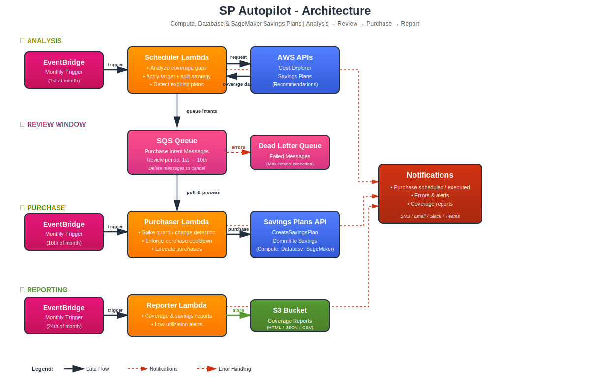
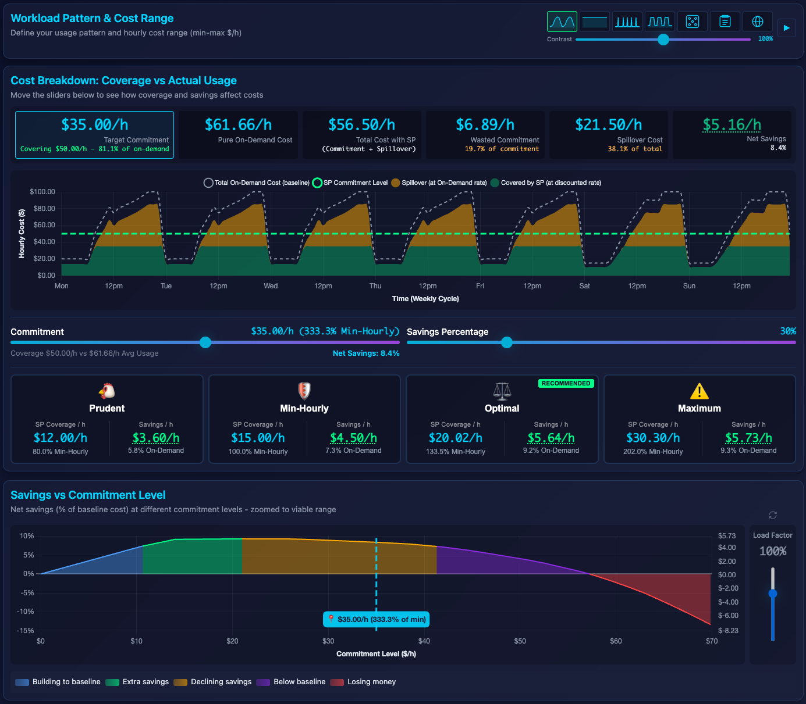

# AWS Savings Plans Automation Module

[](https://opensource.org/licenses/Apache-2.0)


[](https://sonarcloud.io/summary/new_code?id=etiennechabert_terraform-aws-sp-autopilot)
[](https://sonarcloud.io/summary/new_code?id=etiennechabert_terraform-aws-sp-autopilot)
[](https://sonarcloud.io/summary/new_code?id=etiennechabert_terraform-aws-sp-autopilot)

[](https://github.com/etiennechabert/terraform-aws-sp-autopilot/actions/workflows/pr-checks.yml)
[](https://codecov.io/gh/etiennechabert/terraform-aws-sp-autopilot)
[](https://buymeacoffee.com/etiennechak)

Automates AWS Savings Plans purchases based on usage analysis, maintaining consistent coverage while limiting financial exposure through incremental commitments.

[**Try the interactive simulator**](https://etiennechabert.github.io/terraform-aws-sp-autopilot/) — Visualize strategies and find the optimal Savings Plan for your workload before deploying.

## Key Features

- **Automated Savings Plans purchasing** — Maintains target coverage without manual intervention
- **Three purchase strategies** — Fixed Step, Gap Split, and Follow-AWS for different workload patterns
- **Three SP types supported** — Compute, Database, and SageMaker independently tracked
- **Human review window** — Configurable delay between scheduling and purchasing allows cancellation
- **Risk management** — Spreads financial commitments over time with configurable purchase limits
- **Email & webhook notifications** — SNS, Slack, and Microsoft Teams integration

## Quick Start

```hcl
module "savings_plans" {
  source  = "etiennechabert/sp-autopilot/aws"
  version = "~> 1.0"

  purchase_strategy = {
    target = { fixed = { coverage_percent = 90 } }
    split  = { fixed_step = { step_percent = 10 } }
  }

  sp_plans = {
    compute   = { enabled = true, plan_type = "all_upfront_one_year" }
    database  = { enabled = false }
    sagemaker = { enabled = false }
  }

  cron_schedules = {
    scheduler = "cron(0 8 1 * ? *)"   # 1st of month at 8 AM UTC
    purchaser = "cron(0 8 10 * ? *)"  # 10th of month
    reporter  = "cron(0 9 24 * ? *)"  # 24th of month
  }

  notifications = {
    emails = ["devops@example.com"]
  }

}
```

### Examples

See the [`examples/`](examples/) directory for complete, working examples:

- **[single-account-compute](examples/single-account-compute/)** — Basic single-account Compute SP deployment
- **[organizations](examples/organizations/)** — AWS Organizations multi-account setup
- **[dynamic-strategy](examples/dynamic-strategy/)** — Dynamic target with gap split

## Architecture

The module consists of three Lambda functions with SQS queue coordination:



**Workflow:**

1. **Scheduler Lambda** (e.g., 1st of month)
   - Purges stale queue messages
   - Analyzes current coverage (separate for Compute/Database/SageMaker)
   - Gets AWS recommendations
   - Applies purchase strategy
   - Queues purchase intents to SQS

2. **SQS Queue** (maximum 14-day review window)
   - Holds purchase intents for up to 14 days
   - Users can delete messages to cancel purchases
   - Messages include full details and idempotency tokens

3. **Purchaser Lambda** (e.g., 10th of month)
   - Processes queue messages
   - Executes purchases via AWS CreateSavingsPlan API
   - Sends email summary

4. **Reporter Lambda** (e.g., 24th of month)
   - Generates HTML spending reports
   - Stores in S3
   - Optionally emails stakeholders

## Interactive Simulator

The module includes an interactive **[Savings Plan Simulator](https://etiennechabert.github.io/terraform-aws-sp-autopilot/)** to visualize coverage strategies and their cost impact before deploying anything. Generated reports link to the simulator pre-loaded with your data, allowing stakeholders to explore "what-if" scenarios across different target/split combinations.

[](https://etiennechabert.github.io/terraform-aws-sp-autopilot/)

## Configuration

### `purchase_strategy`

Strategy is configured with two orthogonal dimensions: **target** (what coverage to aim for) and **split** (how to reach the target). Both must be specified.

#### Targets

- **`fixed`** — Target a fixed coverage percentage you define (`coverage_percent`).
- **`dynamic`** — Automatically determines the optimal coverage target based on usage patterns using a knee-point algorithm (`risk_level`: `prudent`, `min_hourly`, `optimal`, `maximum`).
- **`aws`** — Uses AWS Cost Explorer recommendations directly without modification.

#### Splits

- **`one_shot`** — Purchases the entire gap to the target in a single cycle.
- **`fixed_step`** — Purchases a fixed percentage of spend per cycle (`step_percent`).
- **`gap_split`** — Divides the remaining coverage gap by a configurable divider each cycle (`divider`), with optional `min_purchase_percent` and `max_purchase_percent` bounds.

#### Recommended Combinations

##### Dynamic Target + Gap Split (Recommended)

Automatically determines the optimal coverage target based on usage patterns, dividing the coverage gap by a configurable divider each cycle.

```hcl
purchase_strategy = {
  target = { dynamic = { risk_level = "min_hourly" } }
  split  = { gap_split = { divider = 2 } }
}
```

##### Fixed Target + Fixed Step Split

Target a fixed coverage percentage, purchasing a fixed step each cycle.

```hcl
purchase_strategy = {
  target = { fixed = { coverage_percent = 100 } }
  split  = { fixed_step = { step_percent = 10 } }
}
```

##### AWS Target + One Shot

Uses AWS Cost Explorer recommendations directly without modification.

```hcl
purchase_strategy = {
  target = { aws = {} }
  split  = { one_shot = {} }
}
```

**Use with caution:** AWS recommendations can be aggressive.

#### Other Settings

- **`renewal_window_days`** (default: `7`) — How many days before a Savings Plan expires to schedule its replacement. The scheduler will include expiring plans in its coverage gap calculation so replacements are purchased before expiration.
- **`purchase_cooldown_days`** (default: `7`) — After purchasing a Savings Plan, block new purchases for that specific SP type (Compute, Database, or SageMaker) for this many days. Prevents duplicates while Cost Explorer data catches up (24-48h lag).
- **`min_commitment_per_plan`** (default: `0.001`) — Minimum hourly commitment per plan in USD. AWS minimum is $0.001/hr.

### `sp_plans`

| Type | Coverage | Max Discount |
|------|----------|--------------|
| **Compute** | EC2, Lambda, Fargate | Up to 66% |
| **Database** | RDS, Aurora, DynamoDB, ElastiCache, DocumentDB, Neptune, Keyspaces, Timestream, DMS | Up to 35% |
| **SageMaker** | Training, Inference, Notebooks | Up to 64% |

`plan_type` values (required when `enabled = true`):
- **`all_upfront`**: `all_upfront_one_year`, `all_upfront_three_year`
- **`partial_upfront`**: `partial_upfront_one_year`, `partial_upfront_three_year`
- **`no_upfront`**: `no_upfront_one_year`, `no_upfront_three_year`

Database SPs only support `no_upfront_one_year`.

```hcl
sp_plans = {
  compute   = { enabled = true, plan_type = "all_upfront_one_year" }
  database  = { enabled = true, plan_type = "no_upfront_one_year" }
  sagemaker = { enabled = false } # plan_type is required ONLY when enabled = true
}
```

### `cron_schedules`

```hcl
cron_schedules = {
  scheduler = "cron(0 8 1 * ? *)"   # When to analyze and schedule purchases
  purchaser = "cron(0 8 10 * ? *)"  # When to execute purchases
  reporter  = "cron(0 9 24 * ? *)"  # When to generate monthly reports
}
```

**Review Window:** Time between `scheduler` and `purchaser` runs allows canceling unwanted purchases.

**Scheduling constraints:**
- Purchaser must run **within 13 days** of the scheduler — SQS messages expire after 14 days, so purchase intents are lost if the purchaser runs too late.
- Purchaser must run **at least 2 days after** the scheduler — provides a review window to cancel unwanted purchases.
- Reporter must run **at least 2 days after** the purchaser — Cost Explorer needs 24-48h to reflect newly purchased Savings Plans.

The default schedules (1st, 10th, 24th of the month) satisfy all constraints. The module validates these gaps at `terraform plan` time.

### `lambda_config`

Controls which Lambda functions are active and cross-account role assumptions.

```hcl
lambda_config = {
  purchaser = { enabled = false }  # Disable purchaser to review recommendations first
  scheduler = { assume_role_arn = "arn:aws:iam::123456789012:role/SPSchedulerRole" }
}
```

- **`enabled`** — Enable/disable individual Lambda functions (default: `true`). Disable the purchaser to review scheduler recommendations without executing purchases.
- **`assume_role_arn`** — Cross-account role for AWS Organizations deployments (see [AWS Organizations Setup](#aws-organizations-setup))
- **`error_alarm`** — Enable CloudWatch error alarm for the Lambda (default: `true`)

### `notifications`

#### Email

```hcl
notifications = {
  emails = ["devops@example.com", "finops@example.com"]
}
```

#### Slack & Microsoft Teams

```hcl
notifications = {
  emails        = ["devops@example.com"]
  slack_webhook = var.slack_webhook_url  # Mark as sensitive
  teams_webhook = var.teams_webhook_url  # Mark as sensitive
}
```

### Hourly Granularity (Required)

Savings Plans are purchased as hourly commitments ($/hour). This module always analyzes data at hourly granularity for accurate purchase sizing.

**Prerequisite:** You must enable **"Hourly and resource level granularity"** in [AWS Cost Explorer settings](https://console.aws.amazon.com/cost-management/home#/settings). Cost: ~$0.10-$1.00/month. The Scheduler Lambda will fail with an explicit error if hourly granularity is not enabled — no purchases will be scheduled.

## Advanced Topics

### AWS Organizations Setup

For AWS Organizations, Savings Plans must be purchased from the **management account**. Deploy this module in a secondary account and configure cross-account roles.

```hcl
lambda_config = {
  reporter  = { assume_role_arn = "arn:aws:iam::123456789012:role/SPReadOnlyRole" }
  scheduler = { assume_role_arn = "arn:aws:iam::123456789012:role/SPReadOnlyRole" }
  purchaser = { assume_role_arn = "arn:aws:iam::123456789012:role/SPPurchaserRole" }
}
```

**IAM Setup in Management Account:**

1. **Read-Only Role** (Scheduler + Reporter):
   - `ce:GetSavingsPlansPurchaseRecommendation`
   - `ce:GetSavingsPlansCoverage`
   - `savingsplans:DescribeSavingsPlans`

2. **Purchaser Role** (write access):
   - `savingsplans:CreateSavingsPlan`
   - `savingsplans:DescribeSavingsPlans`
   - `ce:GetSavingsPlansCoverage`

See [organizations example](examples/organizations/README.md) for complete setup.

### Recommended Rollout

1. **Reporter only** — Deploy with scheduler and purchaser disabled. Review spending reports to understand your current coverage and savings opportunities.

2. **Reporter + Scheduler** — Enable the scheduler. It queues purchase intents to SQS where you can inspect them, but nothing gets purchased. Review the analysis emails and SQS messages to validate recommendations. You can also purchase manually via the AWS console to understand what the purchaser will do when enabled.

3. **Full automation** — Enable the purchaser and start with `no_upfront_one_year` plan types. You have a configurable window between scheduler and purchaser runs to delete SQS messages and cancel unwanted purchases. Once confident after the first year, switch to `all_upfront_three_year` — 3-year plans offer significantly higher discount rates, allowing you to push coverage further above min-hourly spend. Expiring 1Y plans will naturally get replaced by 3Y over time.

4. **Sit back and relax** — Check your purchase notification emails each month, and if everything looks fine, admire your report showing coverage and savings grow over time. And maybe [buy Etienne a coffee](https://buymeacoffee.com/etiennechak) if the module saved you time and money.

### Canceling Purchases

To cancel scheduled purchases before execution:

1. Navigate to AWS Console → SQS → `sp-autopilot-purchase-intents` queue
2. View messages in queue
3. Delete messages for unwanted purchases
4. Purchaser Lambda will skip deleted messages

**Timing:** Must be done between Scheduler and Purchaser runs (during review window).

### Spike Guard

Prevents over-committing to Savings Plans during temporary usage spikes (e.g. Black Friday, seasonal peaks, one-off migrations). Enabled by default, it compares recent average hourly spend against historical baselines and blocks purchases when recent usage is abnormally high.

Two independent checks run automatically:
- **At scheduling time** — compares 14-day avg vs 90-day avg. Blocks scheduling if recent usage spiked above the threshold.
- **At purchase time** — compares current 14-day avg vs the 14-day avg recorded at scheduling time. Blocks purchase if usage dropped since scheduling (confirming the spike was temporary).

Only the specific SP types showing anomalies are blocked — other types proceed normally.

```hcl
purchase_strategy = {
  # ...
  spike_guard = {           # optional, defaults to enabled
    enabled             = true
    long_lookback_days  = 90  # historical baseline period
    short_lookback_days = 14  # recent usage period
    threshold_percent   = 20  # block if recent avg is >= 20% above baseline
  }
}
```

Disable with `spike_guard = { enabled = false }`. The reporter includes a yellow warning banner when a spike is detected.

## Terraform Reference

<!-- BEGIN_TF_DOCS -->
## Requirements

| Name | Version |
|------|---------|
| <a name="requirement_terraform"></a> [terraform](#requirement\_terraform) | >= 1.7 |
| <a name="requirement_aws"></a> [aws](#requirement\_aws) | >= 5.0, < 6.34 |

## Providers

| Name | Version |
|------|---------|
| <a name="provider_archive"></a> [archive](#provider\_archive) | 2.7.1 |
| <a name="provider_aws"></a> [aws](#provider\_aws) | 6.33.0 |

## Inputs

| Name | Description | Type | Default | Required |
|------|-------------|------|---------|:--------:|
| <a name="input_notifications"></a> [notifications](#input\_notifications) | Notification configuration for email, Slack, and Teams | <pre>object({<br/>    emails        = list(string)<br/>    slack_webhook = optional(string)<br/>    teams_webhook = optional(string)<br/>  })</pre> | n/a | yes |
| <a name="input_purchase_strategy"></a> [purchase\_strategy](#input\_purchase\_strategy) | Purchase strategy configuration with orthogonal target + split dimensions | <pre>object({<br/>    renewal_window_days     = optional(number, 7)<br/>    purchase_cooldown_days  = optional(number, 7)<br/>    min_commitment_per_plan = optional(number, 0.001)<br/><br/>    target = object({<br/>      fixed   = optional(object({ coverage_percent = number }))<br/>      aws     = optional(object({}))<br/>      dynamic = optional(object({ risk_level = string }))<br/>    })<br/><br/>    split = object({<br/>      one_shot   = optional(object({}))<br/>      fixed_step = optional(object({ step_percent = number }))<br/>      gap_split = optional(object({<br/>        divider              = number<br/>        min_purchase_percent = optional(number, 1)<br/>        max_purchase_percent = optional(number)<br/>      }))<br/>    })<br/><br/>    spike_guard = optional(object({<br/>      enabled             = optional(bool, true)<br/>      long_lookback_days  = optional(number, 90)<br/>      short_lookback_days = optional(number, 14)<br/>      threshold_percent   = optional(number, 20)<br/>    }), {})<br/>  })</pre> | n/a | yes |
| <a name="input_sp_plans"></a> [sp\_plans](#input\_sp\_plans) | Savings Plans configuration for Compute, Database, and SageMaker | <pre>object({<br/>    compute = object({<br/>      enabled   = bool<br/>      plan_type = optional(string)<br/>    })<br/><br/>    database = object({<br/>      enabled   = bool<br/>      plan_type = optional(string) # AWS only supports "no_upfront_one_year" for Database SPs<br/>    })<br/><br/>    sagemaker = object({<br/>      enabled   = bool<br/>      plan_type = optional(string)<br/>    })<br/>  })</pre> | n/a | yes |
| <a name="input_cron_schedules"></a> [cron\_schedules](#input\_cron\_schedules) | EventBridge cron schedules for each Lambda function. Set to null to disable a schedule. | <pre>object({<br/>    scheduler = optional(string) # Set to null to disable. Default: "cron(0 8 1-7 * MON *)"<br/>    purchaser = optional(string) # Set to null to disable. Default: "cron(0 8 10-17 * MON *)"<br/>    reporter  = optional(string) # Set to null to disable. Default: "cron(0 8 20-27 * MON *)"<br/>  })</pre> | <pre>{<br/>  "purchaser": "cron(0 8 10-17 * MON *)",<br/>  "reporter": "cron(0 8 20-27 * MON *)",<br/>  "scheduler": "cron(0 8 1-7 * MON *)"<br/>}</pre> | no |
| <a name="input_encryption"></a> [encryption](#input\_encryption) | Encryption configuration for SNS, SQS, and S3 | <pre>object({<br/>    sns_kms_key = optional(string, "alias/aws/sns") # Default: AWS managed KMS key. Set to null to disable.<br/>    sqs_kms_key = optional(string, "alias/aws/sqs") # Default: AWS managed KMS key. Set to null to disable.<br/>    s3 = optional(object({<br/>      kms_key = optional(string) # null = AES256 (SSE-S3, free), set to KMS key ARN for SSE-KMS<br/>    }), {})<br/>  })</pre> | `{}` | no |
| <a name="input_lambda_config"></a> [lambda\_config](#input\_lambda\_config) | Lambda function configuration including enable/disable controls, performance settings, cross-account role ARNs, and error alarms | <pre>object({<br/>    scheduler = optional(object({<br/>      enabled         = optional(bool, true)<br/>      memory_mb       = optional(number, 128)<br/>      timeout         = optional(number, 300)<br/>      assume_role_arn = optional(string)     # Role to assume for Cost Explorer and Savings Plans APIs (AWS Orgs)<br/>      error_alarm     = optional(bool, true) # Enable CloudWatch error alarm for this Lambda<br/>    }), {})<br/><br/>    purchaser = optional(object({<br/>      enabled         = optional(bool, true)<br/>      memory_mb       = optional(number, 128)<br/>      timeout         = optional(number, 300)<br/>      assume_role_arn = optional(string)     # Role to assume for Savings Plans purchase APIs (AWS Orgs)<br/>      error_alarm     = optional(bool, true) # Enable CloudWatch error alarm for this Lambda<br/>    }), {})<br/><br/>    reporter = optional(object({<br/>      enabled         = optional(bool, true)<br/>      memory_mb       = optional(number, 128)<br/>      timeout         = optional(number, 300)<br/>      assume_role_arn = optional(string)     # Role to assume for Cost Explorer and Savings Plans APIs (AWS Orgs)<br/>      error_alarm     = optional(bool, true) # Enable CloudWatch error alarm for this Lambda<br/>    }), {})<br/>  })</pre> | `{}` | no |
| <a name="input_monitoring"></a> [monitoring](#input\_monitoring) | CloudWatch monitoring and alarm configuration | <pre>object({<br/>    dlq_alarm                 = optional(bool, true)<br/>    error_threshold           = optional(number, 1)  # Threshold for Lambda error alarms (configured per-Lambda in lambda_config)<br/>    low_utilization_threshold = optional(number, 70) # Alert when Savings Plans utilization falls below this percentage<br/>  })</pre> | `{}` | no |
| <a name="input_name_prefix"></a> [name\_prefix](#input\_name\_prefix) | Prefix for all resource names. Allows multiple module deployments in the same AWS account. | `string` | `"sp-autopilot"` | no |
| <a name="input_reporting"></a> [reporting](#input\_reporting) | Report generation and storage configuration | <pre>object({<br/>    format             = optional(string, "html")<br/>    email_reports      = optional(bool, false)<br/>    include_debug_data = optional(bool, false)<br/><br/>    s3_lifecycle = optional(object({<br/>      transition_ia_days         = optional(number, 90)<br/>      transition_glacier_days    = optional(number, 180)<br/>      expiration_days            = optional(number, 365)<br/>      noncurrent_expiration_days = optional(number, 90)<br/>    }), {})<br/>  })</pre> | `{}` | no |
| <a name="input_s3_access_logging"></a> [s3\_access\_logging](#input\_s3\_access\_logging) | Enable S3 access logging for the reports bucket (for compliance/auditing) | <pre>object({<br/>    enabled         = optional(bool, false)<br/>    target_prefix   = optional(string, "access-logs/")<br/>    expiration_days = optional(number, 90)<br/>  })</pre> | `{}` | no |
| <a name="input_tags"></a> [tags](#input\_tags) | Additional tags to apply to all resources | `map(string)` | `{}` | no |

## Outputs

| Name | Description |
|------|-------------|
| <a name="output_database_sp_configuration"></a> [database\_sp\_configuration](#output\_database\_sp\_configuration) | Database Savings Plans configuration for monitoring |
| <a name="output_dlq_alarm_arn"></a> [dlq\_alarm\_arn](#output\_dlq\_alarm\_arn) | ARN of the DLQ depth alarm |
| <a name="output_dlq_arn"></a> [dlq\_arn](#output\_dlq\_arn) | ARN of the dead letter queue |
| <a name="output_dlq_url"></a> [dlq\_url](#output\_dlq\_url) | URL of the dead letter queue |
| <a name="output_lambda_environment_database_sp"></a> [lambda\_environment\_database\_sp](#output\_lambda\_environment\_database\_sp) | Database SP enablement flag for Lambda functions |
| <a name="output_lambda_environment_sagemaker_sp"></a> [lambda\_environment\_sagemaker\_sp](#output\_lambda\_environment\_sagemaker\_sp) | SageMaker SP enablement flag for Lambda functions |
| <a name="output_module_configuration"></a> [module\_configuration](#output\_module\_configuration) | Module configuration summary |
| <a name="output_purchaser_error_alarm_arn"></a> [purchaser\_error\_alarm\_arn](#output\_purchaser\_error\_alarm\_arn) | ARN of the Purchaser Lambda error alarm |
| <a name="output_purchaser_lambda_arn"></a> [purchaser\_lambda\_arn](#output\_purchaser\_lambda\_arn) | ARN of the Purchaser Lambda function |
| <a name="output_purchaser_lambda_name"></a> [purchaser\_lambda\_name](#output\_purchaser\_lambda\_name) | Name of the Purchaser Lambda function |
| <a name="output_purchaser_role_arn"></a> [purchaser\_role\_arn](#output\_purchaser\_role\_arn) | ARN of the Purchaser Lambda execution role |
| <a name="output_purchaser_rule_arn"></a> [purchaser\_rule\_arn](#output\_purchaser\_rule\_arn) | ARN of the EventBridge rule for Purchaser Lambda |
| <a name="output_purchaser_rule_name"></a> [purchaser\_rule\_name](#output\_purchaser\_rule\_name) | Name of the EventBridge rule for Purchaser Lambda |
| <a name="output_queue_arn"></a> [queue\_arn](#output\_queue\_arn) | ARN of the purchase intents queue |
| <a name="output_queue_url"></a> [queue\_url](#output\_queue\_url) | URL of the purchase intents queue |
| <a name="output_reporter_error_alarm_arn"></a> [reporter\_error\_alarm\_arn](#output\_reporter\_error\_alarm\_arn) | ARN of the Reporter Lambda error alarm |
| <a name="output_reporter_lambda_arn"></a> [reporter\_lambda\_arn](#output\_reporter\_lambda\_arn) | ARN of the Reporter Lambda function |
| <a name="output_reporter_lambda_name"></a> [reporter\_lambda\_name](#output\_reporter\_lambda\_name) | Name of the Reporter Lambda function |
| <a name="output_reporter_role_arn"></a> [reporter\_role\_arn](#output\_reporter\_role\_arn) | ARN of the Reporter Lambda execution role |
| <a name="output_reporter_rule_arn"></a> [reporter\_rule\_arn](#output\_reporter\_rule\_arn) | ARN of the EventBridge rule for Reporter Lambda |
| <a name="output_reporter_rule_name"></a> [reporter\_rule\_name](#output\_reporter\_rule\_name) | Name of the EventBridge rule for Reporter Lambda |
| <a name="output_reports_bucket_arn"></a> [reports\_bucket\_arn](#output\_reports\_bucket\_arn) | ARN of the reports bucket |
| <a name="output_reports_bucket_name"></a> [reports\_bucket\_name](#output\_reports\_bucket\_name) | Name of the reports bucket |
| <a name="output_sagemaker_sp_configuration"></a> [sagemaker\_sp\_configuration](#output\_sagemaker\_sp\_configuration) | SageMaker Savings Plans configuration for monitoring |
| <a name="output_scheduler_error_alarm_arn"></a> [scheduler\_error\_alarm\_arn](#output\_scheduler\_error\_alarm\_arn) | ARN of the Scheduler Lambda error alarm |
| <a name="output_scheduler_lambda_arn"></a> [scheduler\_lambda\_arn](#output\_scheduler\_lambda\_arn) | ARN of the Scheduler Lambda function |
| <a name="output_scheduler_lambda_name"></a> [scheduler\_lambda\_name](#output\_scheduler\_lambda\_name) | Name of the Scheduler Lambda function |
| <a name="output_scheduler_role_arn"></a> [scheduler\_role\_arn](#output\_scheduler\_role\_arn) | ARN of the Scheduler Lambda execution role |
| <a name="output_scheduler_rule_arn"></a> [scheduler\_rule\_arn](#output\_scheduler\_rule\_arn) | ARN of the EventBridge rule for Scheduler Lambda |
| <a name="output_scheduler_rule_name"></a> [scheduler\_rule\_name](#output\_scheduler\_rule\_name) | Name of the EventBridge rule for Scheduler Lambda |
| <a name="output_sns_topic_arn"></a> [sns\_topic\_arn](#output\_sns\_topic\_arn) | ARN of the SNS topic for notifications |
<!-- END_TF_DOCS -->

## Contributing

Contributions welcome! See [CONTRIBUTING.md](CONTRIBUTING.md) for branch naming, commit conventions, and PR process.

See [DEVELOPMENT.md](DEVELOPMENT.md) for local setup and testing.

## Support

For questions, issues, or feature requests, please open a [GitHub issue](https://github.com/etiennechabert/terraform-aws-sp-autopilot/issues). If you want to support the project, you can [buy Etienne a coffee](https://buymeacoffee.com/etiennechak).

## License

This module is open-source software licensed under the [Apache License 2.0](LICENSE).
